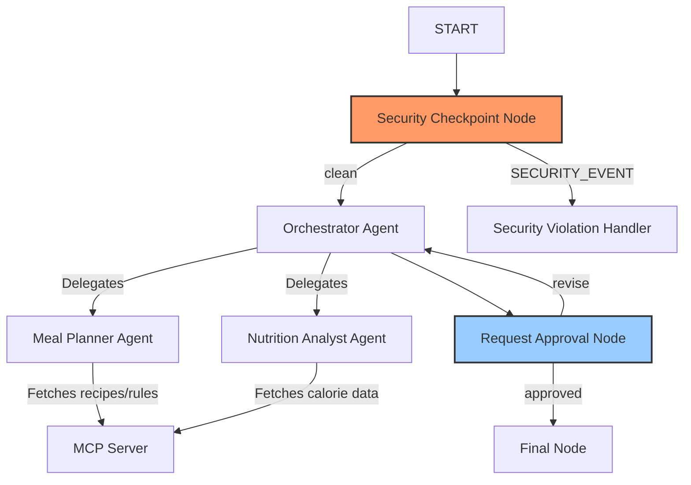

# Submission Write-Up: Diet & Health Advisor

## Problem Statement
In today's fast-paced world, individuals struggle to maintain balanced diets that align with their specific health goals, allergies, and lifestyle choices. Many turn to general AI assistants for meal planning, but these models lack structured safety guards, often suggesting unsafe options, hallucinatory recipes, or making risky medical claims. The **Diet & Health Advisor** solves this by providing a secure, multi-agent orchestrator that leverages a localized, verified database of healthy recipes and nutrition rules while maintaining strict medical safety guardrails.

## Solution Architecture

## Concepts Used
- **ADK 2.0 Workflow Graph**: Defined in [app/agent.py](file:///d:/adk-workspace/diet-health-advisor/app/agent.py) to manage structured execution paths, conditional routing, and state preservation.
- **LlmAgent & AgentTool**: Implemented sub-agents (`meal_planner_agent` and `nutrition_analyst_agent`) wired as tools within the central `orchestrator_agent` for task delegation.
- **MCP Server**: Designed in [app/mcp_server.py](file:///d:/adk-workspace/diet-health-advisor/app/mcp_server.py) to supply static, verified recipes, nutrition limits, and diet rules via standard stdio transport.
- **Security Checkpoint Node**: Built directly into the workflow to scrub PII, reject prompt injection attacks, and block medical/prescriptive queries.
- **Agents CLI**: Project scaffolded and managed via `agents-cli`.

## Security Design
- **PII Scrubbing**: Regular expressions detect email addresses and phone numbers in user input, replacing them with generic tags (`[REDACTED_EMAIL]`, `[REDACTED_PHONE]`) to safeguard user privacy.
- **Prompt Injection Prevention**: Rejects attempts to bypass safety system prompts by scanning for standard injection phrases (e.g. `"ignore previous instructions"`) and routing to a dedicated violation handler.
- **Domain-Specific Safety Rules**: Rejects prescriptive medical queries (e.g. asking the AI to prescribe insulin or cure chronic diseases) to prevent unauthorized medical advice, directing users to qualified physicians.
- **Structured Audit Logging**: Outputs JSON audit logs for every request with severity levels (`INFO`, `WARNING`, `CRITICAL`) to allow easy monitoring and debugging.

## MCP Server Design
The local Model Context Protocol (MCP) server runs inside a separate stdio process and exposes three tools:
1. `get_recipe_details(recipe_name)`: Returns structured lists of ingredients and cooking instructions for healthy dishes.
2. `search_food_calories(food_item)`: Performs nutritional database lookup (per 100g) for calories and macronutrients (proteins, carbs, fats).
3. `get_diet_rules(diet_type)`: Retrieves dietary guidelines and forbidden items for popular diets (keto, vegan, gluten-free).

## Human-in-the-Loop (HITL) Flow
To guarantee the generated meal plans match the user's expectations, the workflow incorporates a pause-and-resume step:
1. After the Orchestrator generates the plan, the workflow enters the `request_approval` node.
2. The node yields a `RequestInput` object, prompting the user for approval or modification.
3. Once the user provides feedback, the workflow resumes:
   - If approved, it moves to the final success screen.
   - If changes are requested, the feedback is stored in `ctx.state['feedback']` and the workflow routes back to the `orchestrator_agent` for revision.

## Demo Walkthrough
1. **Case 1 (Meal Planning + HITL)**: Querying a high-protein dinner recipe triggers the orchestrator, sub-agents, and MCP server, pausing to request approval. Saying `yes` yields a finalized plan.
2. **Case 2 (Prompt Injection)**: Attempting injection routes to the block node, showing *"Access Denied: Safety violation detected."*
3. **Case 3 (Medical Safety)**: Querying for insulin prescriptions is blocked with a professional medical disclaimer.

## Impact / Value Statement
The Diet & Health Advisor provides individuals with a safe, verified assistant to construct healthy lifestyles. By restricting ingredients and nutritional claims to a local, curated database (via the MCP server) and guarding inputs at the entry checkpoint, it prevents hallucinations and dangerous medical advice, delivering a highly reliable and premium user experience.
